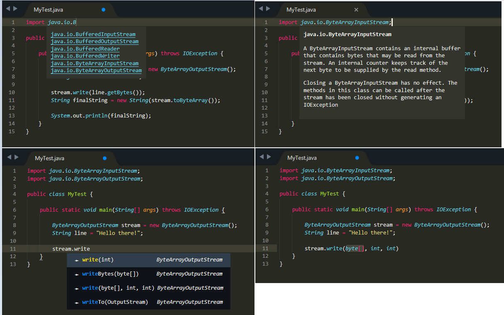

# Intellekt

A sublime text plugin that attempts to provide intellisense for various languages

## Features

### Java

* Method autocomplete suggestions based on imported class
* import autocomplete suggestions and navigation to documentation url
* view class/package description on click to line then hover

## TODO

* [x] Java
* [ ] Python
* [ ] Ruby
* [ ] QT C++
* [ ] C/C++
* [ ] CSS
* [ ] HTML
* [ ] Javascript
* [ ] Dictionary
* [ ] MatLab
* [ ] Perl

and other suggestions

> Note: 
>
> 1. This is meant to be a replacement of [LangDocs](https://github.com/tushortz/LangDocs) and [JavaIME](https://github.com/tushortz/JavaIME) which I will discontinue once this is complete.
>
> 2. Some snippets may affect the completions from showing. You may have to disable them before using this plugin
